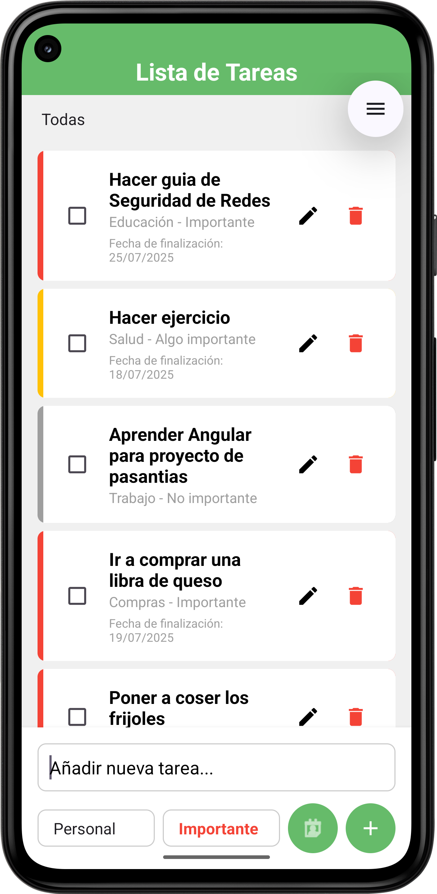

---

# ✅ To-Do List - Aplicación de Lista de Tareas

Este proyecto es una aplicación móvil desarrollada en **Kotlin** para dispositivos Android. Permite a los usuarios gestionar tareas personales de manera sencilla y eficiente, incluyendo funciones como crear, editar, eliminar y persistir tareas entre sesiones.
Tiene como finalidad facilitar la organización personal diaria a través de una interfaz intuitiva y moderna.

---

# 🧑‍💻 Integrantes

| Nombre de Integrante             | Carnet   |
| -------------------------------- | -------- |
| Jeremy Edenilson Flores Portillo | FP240479 |
| Josué Eduardo García Estrada     | GE240098 |
| Edgar Josué Gómez Meléndez       | GM240279 |
| Oscar Daniel Soto Jovel          | SJ241841 |

---

## 🚀 Tecnologías Utilizadas

La aplicación fue construida utilizando las siguientes tecnologías y herramientas:

### 📱 Android

* **Kotlin**
  Lenguaje de programación principal de la aplicación.

* **Android SDK**
  Kit de desarrollo oficial para aplicaciones Android.

* **Gradle (8.10.2)**
  Sistema de automatización de compilación (Kotlin DSL).

* **Material Design**
  Estándar de diseño de interfaz moderna para Android.

### 💾 Persistencia

* **SharedPreferences**
  Para almacenamiento local ligero de las tareas.

* **SQLite**
  Para persistencia estructurada.

---

# 📲 ¿Cómo ejecutar el proyecto?

## ✅ Requisitos Previos

Antes de clonar o ejecutar el proyecto, asegúrate de tener instalado:

* **Android Studio**
* **Java JDK 17**
* **Gradle 8.13**
* **Dispositivo físico o emulador Android (API 24 o superior)**

---

## ⚙️ Instalación Paso a Paso

### 1. Clonar el Repositorio

```bash
git clone https://github.com/JosueGarcia-UDB/todo-list.git
cd todo-list
```

### 2. Abrir el Proyecto en Android Studio

* Ir a: `Archivo > Abrir`
* Seleccionar la carpeta del proyecto

### 3. Sincronizar el Proyecto

* Esperar a que Android Studio sincronice automáticamente con Gradle.

### 4. Ejecutar la Aplicación

* Usar el botón ▶️ en Android Studio para compilar y correr la app en un emulador o dispositivo físico conectado.

---

## 📝 Funcionalidades Principales

* ➕ **Añadir tareas**
  Crear nuevas tareas con título y descripción.

* ✏️ **Editar tareas**
  Modificar tareas existentes fácilmente.

* 🗑️ **Eliminar tareas**
  Borrar tareas una vez completadas o innecesarias.

* 💾 **Persistencia local**
  Guarda automáticamente las tareas entre sesiones.

* 🎨 **Interfaz moderna**
  Basada en principios de Material Design para mejor experiencia de usuario.

---

## 📸 Ejecución de la Aplicación

A continuación se muestra una imagen de ejemplo de la interfaz de la aplicación en funcionamiento:
<br>
<div align="center">
  
</div>
